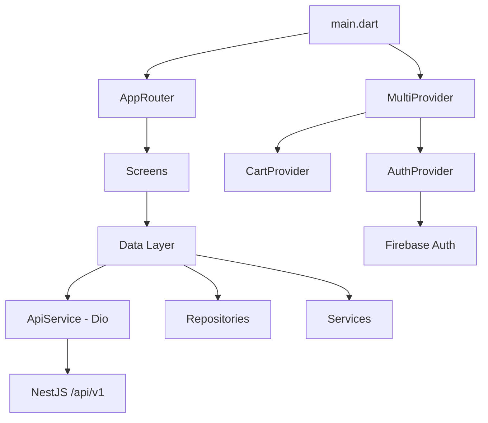
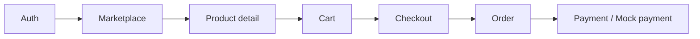

# AgriLink Mobile - Đánh giá hiện trạng dự án

> Cập nhật: 03/07/2026  
> Mục tiêu tài liệu: chuẩn hóa hiện trạng để chia việc nhóm, tránh phân công lệch so với code thật.

---

## 1. Kết luận nhanh

AgriLink Mobile hiện đang ở mức **MVP sớm, khoảng 35-40% hoàn thành**.

Phần đã tốt nhất là nền tảng app: auth Firebase + backend JWT, routing, theme, reusable widgets, marketplace, product detail và cart local. Phần còn thiếu lớn nhất là **business flow thương mại thật**: checkout, order, payment, order history và trạng thái đơn hàng.

Ưu tiên dự án trong 2 tuần tới nên là:

1. Checkout + Order flow
2. Product CRUD + upload ảnh
3. Profile edit + refresh token
4. Notifications UI + market prices
5. Traceability QR nếu còn thời gian

Các module nâng cao như Ads, Cooperative, Chat, Gamification nên để sau MVP.

---

## 2. Quyết định role system

### Role đang có trong mobile hiện tại

Code mobile hiện đang dùng:

| Role | Ý nghĩa | Trạng thái |
|------|---------|------------|
| `farmer` | Nông dân / người bán nông sản | Đang dùng |
| `supplier` | Nhà cung cấp vật tư | Đang dùng |
| `customer` / `buyer` | Người mua | Đang dùng |

Các file liên quan:

- `lib/data/models/user_model.dart`
- `lib/screens/auth/role_picker_screen.dart`
- `lib/screens/home/home_screen.dart`
- `lib/screens/dashboard/farmer/*`
- `lib/screens/dashboard/supplier/*`
- `lib/screens/dashboard/customer/*`

### Khuyến nghị

**Giữ `farmer / supplier / customer` cho MVP hiện tại.**

Lý do:

- Code hiện tại đã tổ chức theo 3 role này.
- Backend hiện đang map customer-side thành `buyer`.
- Marketplace, cart và dashboard customer đang đi theo mô hình người mua.
- Đổi sang `farmer / agent / expert` sẽ là breaking change lớn và làm chậm team.

Nếu giảng viên hoặc master prompt bắt buộc dùng `agent / expert`, hãy tạo riêng task **Role Migration** và làm trước mọi feature khác. Không nên vừa đổi role vừa làm checkout/product/order vì dễ conflict và gãy flow.

---

## 3. Kiến trúc hiện tại

| Layer | Thư mục | Vai trò |
|-------|---------|--------|
| Core | `lib/core/` | Constants, theme, utils |
| Data | `lib/data/models/` | Model dữ liệu |
| Data | `lib/data/repositories/` | Repository gọi API theo domain |
| Data | `lib/data/services/` | ApiService, Auth, Firebase, Notification |
| State | `lib/data/providers/` | Provider như CartProvider |
| UI | `lib/screens/` | Màn hình |
| Widgets | `lib/widgets/` | Component tái sử dụng |
| Router | `lib/router/app_router.dart` | Named routes |

Kiến trúc đủ dùng cho MVP. Chưa cần đổi sang Bloc/Riverpod trong giai đoạn này vì sẽ tăng chi phí refactor.

---

## 4. Trạng thái module

### Đã chạy được

| Module | Trạng thái | Ghi chú |
|--------|------------|--------|
| Splash | Hoạt động | Check token rồi redirect |
| Login OTP | Hoạt động | Firebase Phone Auth, có mock fallback |
| OTP Verify | Hoạt động | Firebase ID token -> BE `/auth/sync` |
| JWT storage | Hoạt động | `flutter_secure_storage` |
| Role Picker | Hoạt động | `PUT /users/me/role` |
| Home navigation | Hoạt động | Theo role |
| Marketplace | Hoạt động | Có gọi product API |
| Product detail | Hoạt động | Có thêm vào giỏ |
| Cart local | Hoạt động | Chưa sync BE |

### Có UI nhưng còn mock / chưa hoàn thiện

| Module | Trạng thái | Ghi chú |
|--------|------------|--------|
| Farmer dashboard | Mock | Data hardcode |
| Supplier dashboard | Mock | Data hardcode |
| Customer dashboard | Mock | Recommended/category tĩnh |
| Orders tab | Mock | Chưa có order flow thật |
| Prices screen | Mock | Cần gọi `/market-prices` |
| Trace screen | Mock | Cần gọi `/trace/*` |
| Bulk listing | Mock | Chưa có service/repository |
| Add product | Chưa đủ | Form có nhưng upload/API cần hoàn thiện |

### Chưa có hoặc thiếu nặng

| Module | Mức độ thiếu | Ghi chú |
|--------|--------------|--------|
| Checkout | Rất cao | Core MVP chưa có |
| Order history/detail | Rất cao | Core MVP chưa có |
| Payment | Cao | BE có payment nhưng mobile chưa nối |
| Notification UI | Cao | Có service, chưa có màn |
| Profile edit | Trung bình | Profile hiện còn tĩnh |
| Image upload | Trung bình | Cần storage service + picker |
| Wishlist | Trung bình | BE có, mobile chưa có UI |
| Reviews | Trung bình | BE có, mobile chưa có UI |
| QR scan | Trung bình | Chưa tích hợp scanner |
| Push notification | Thấp cho MVP | Để sau |
| Chat | Thấp cho MVP | Để sau |

---

## 5. Backend integration

### API mobile đang dùng thật

| API | Method | Trạng thái |
|-----|--------|------------|
| `/auth/sync` | POST | Đang dùng |
| `/users/me` | GET | Đang dùng |
| `/users/me/role` | PUT | Đang dùng |
| `/products` | GET | Đang dùng |
| `/products/:id` | GET | Đang dùng |
| `/products/categories` | GET | Có fallback |

### API có sẵn nên ưu tiên nối tiếp

| API group | Lý do |
|----------|-------|
| Orders / Checkout | Core flow mua hàng |
| Payment | Demo thương mại hoàn chỉnh |
| Product images / Storage | Cần cho farmer/supplier đăng sản phẩm |
| Notifications | Tạo cảm giác app thật |
| Wishlist | Dễ demo, liên quan product |
| Reviews | Tăng độ hoàn thiện product detail |
| Market prices | Tốt cho dashboard |
| Traceability | Tốt nếu có thời gian |

---

## 6. Rủi ro kỹ thuật

| Rủi ro | Mức độ | Cách xử lý |
|--------|--------|-----------|
| Đổi role system giữa sprint | Cao | Chỉ làm nếu bắt buộc, làm branch riêng trước |
| Checkout/order chưa có | Cao | Giao riêng 1 thành viên làm core flow |
| Cart chỉ local | Trung bình | MVP có thể chấp nhận, nhưng cần order tạo từ cart |
| Socket notification 404 | Trung bình | Đã tắt socket flag; dùng REST trước |
| Image upload chưa có | Trung bình | TV1/TV2 phối hợp tạo StorageService |
| Không có test | Trung bình | Ít nhất thêm smoke/unit test cho provider/service quan trọng |
| API constants dễ conflict | Trung bình | Mỗi PR thêm constants theo section riêng |

---

## 7. Đánh giá cuối

Mobile đã có nền khá tốt để chia việc song song. Tuy nhiên kế hoạch nên tập trung vào **MVP thương mại** trước:

Nếu demo được flow trên, dự án sẽ thuyết phục hơn nhiều so với việc có nhiều module phụ nhưng không có mua hàng thật.

