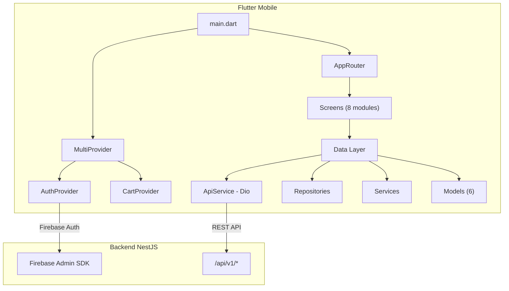
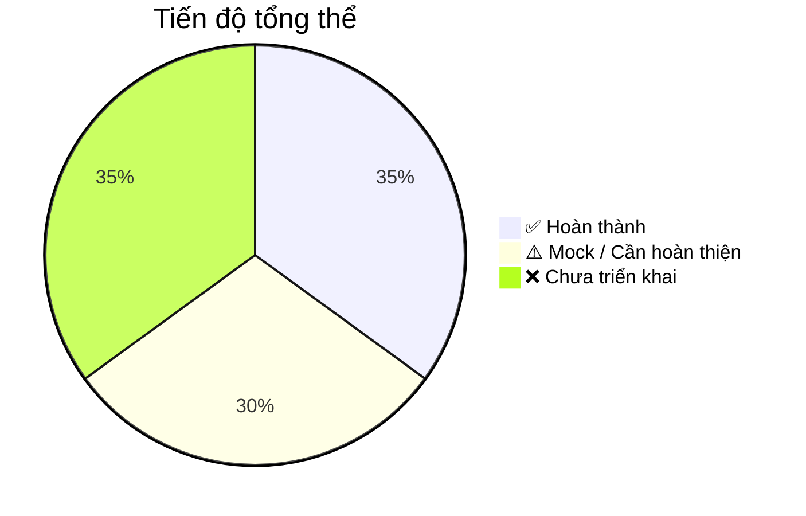

# 🌿 Đánh giá tổng quan hệ thống AgriLink Mobile

> Đánh giá tại thời điểm: **02/07/2026**
> Branch hiện tại: `codex/mobile-firebase-auth-sync` (trên `develop`)

---

## 1. Kiến trúc tổng thể



### Cấu trúc thư mục

| Layer | Thư mục | Mô tả |
|-------|---------|-------|
| **Core** | `lib/core/constants/` | API endpoints, colors, strings, text styles |
| | `lib/core/theme/` | Material theme (light) |
| | `lib/core/utils/` | Token storage (SecureStorage), phone formatter |
| **Data** | `lib/data/models/` | 6 models: User, Product, CartItem, BulkListing, CooperativeMember, Notification |
| | `lib/data/providers/` | CartProvider (ChangeNotifier) |
| | `lib/data/repositories/` | AuthRepository, ProductRepository |
| | `lib/data/services/` | ApiService (Dio), AuthService (Firebase), AuthProvider, NotificationService, ProductService |
| **UI** | `lib/screens/` | 8 module screens |
| | `lib/widgets/` | Reusable widgets (auth, common, product) |
| **Routing** | `lib/router/` | Named-route generator |

> [!NOTE]
> Kiến trúc tuân theo mô hình **Provider + Repository** pattern, phổ biến trong Flutter cho dự án cỡ vừa. Phân tách rõ Data ↔ UI ↔ Business Logic.

---

## 2. Trạng thái từng module

### ✅ Hoàn thành / Hoạt động được

| Module | Trạng thái | Chi tiết |
|--------|-----------|----------|
| **Splash Screen** | ✅ Done | Auto-check token → redirect login/home |
| **Auth – Login** | ✅ Done | Nhập SĐT → gửi OTP Firebase |
| **Auth – OTP** | ✅ Done | Xác minh OTP → sync với BE (`POST /auth/sync`) → lưu JWT |
| **Auth – Role Picker** | ✅ Done | Chọn role (Farmer / Supplier / Customer) → `PUT /users/me/role` |
| **Auth – Mock fallback** | ✅ Done | Khi Firebase lỗi hoặc chạy trên Web → auto mock OTP |
| **Home Screen** | ✅ Done | Bottom nav 4 tabs, phân luồng theo role |
| **Profile Tab** | ✅ Done | Hiện thông tin user, role badge, nút đăng xuất |
| **Cart System** | ✅ Done | Add/remove/update quantity, tính tổng tiền (local state) |
| **Marketplace** | ✅ Done | Danh sách sản phẩm, filter category, tìm kiếm |
| **Product Detail** | ✅ Done | Xem chi tiết + thêm vào giỏ |
| **Product Card/Badge** | ✅ Done | Reusable widget hiện sản phẩm |

### ⚠️ Có UI nhưng chưa kết nối BE thực / Dùng dữ liệu mock

| Module | Trạng thái | Chi tiết |
|--------|-----------|----------|
| **Farmer Dashboard** | ⚠️ Mock | Có UI đẹp (stat cards, biểu đồ), nhưng data hardcode |
| **Supplier Dashboard** | ⚠️ Mock | Tương tự Farmer, chưa gọi API thực |
| **Customer Dashboard** | ⚠️ Mock | Có recommended products, categories, nhưng data tĩnh |
| **Orders Tab** | ⚠️ Mock | Hardcode 2 đơn hàng mẫu (`ORD-2201`, `ORD-2202`) |
| **Prices Screen** | ⚠️ Mock | UI bảng giá nông sản – data cứng |
| **Trace Screen** | ⚠️ Mock | UI truy xuất nguồn gốc – data cứng |
| **Bulk Listing** | ⚠️ Mock | Form tạo bán sỉ – chưa gọi API |
| **Add Product** | ⚠️ Mock | Form đăng sản phẩm – chưa test với BE thật |

### ❌ Chưa triển khai

| Module | Trạng thái | Chi tiết |
|--------|-----------|----------|
| **Notifications UI** | ❌ Missing | Service có nhưng không có màn hình hiển thị |
| **WebSocket Gateway** | ❌ Disabled | BE chưa có `@WebSocketGateway`, mobile đã tắt flag |
| **Order Management** | ❌ Missing | Không có API order, checkout flow |
| **Payment Integration** | ❌ Missing | BE có VNPay nhưng mobile chưa tích hợp |
| **User Profile Edit** | ❌ Missing | Chỉ có xem, chưa cho sửa tên/avatar |
| **Search Advanced** | ❌ Missing | Chưa có filter giá, khoảng cách, đánh giá |
| **Chat / Messaging** | ❌ Missing | Không có module chat |
| **Push Notifications** | ❌ Missing | Chưa tích hợp FCM push |

---

## 3. Backend Integration (Mobile ↔ NestJS)

### Các API đã kết nối thực

| Endpoint | Method | Mobile sử dụng? | Ghi chú |
|----------|--------|-----------------|---------|
| `/auth/sync` | POST | ✅ Real | Firebase ID token → JWT |
| `/users/me` | GET | ✅ Real | Lấy profile sau login |
| `/users/me/role` | PUT | ✅ Real | Cập nhật role |
| `/products` | GET | ✅ Real | Danh sách sản phẩm |
| `/products/:id` | GET | ✅ Real | Chi tiết sản phẩm |
| `/products` | POST | 🔶 Code có | Tạo sản phẩm (form có, chưa test kỹ) |
| `/products/categories` | GET | 🔶 Code có | Fallback hardcode nếu lỗi |

### Các API có endpoint trong constants nhưng chưa gọi từ UI

| Endpoint | Ghi chú |
|----------|---------|
| `/notifications/unread` | Service có, UI chưa có |
| `/notifications/count` | Service có, UI chưa có |
| `/notifications/:id/read` | Service có, UI chưa có |
| `/notifications/mark-all-read` | Service có, UI chưa có |
| `/cooperatives/bulk-listings` | Constant có, chưa có repository |
| `/cooperatives/me/members` | Constant có, chưa gọi |
| `/cooperatives/harvest-schedules` | Constant có, chưa gọi |

### Các API của BE mà mobile chưa biết đến

| BE Feature | Ghi chú |
|------------|---------|
| Orders / Checkout | BE có module Orders, mobile chưa có |
| VNPay Payment | BE có tích hợp, mobile chưa có |
| Wishlist | BE có, mobile chưa có |
| Gamification (XP) | BE có, mobile chưa có |
| Reviews / Ratings | BE có, mobile chưa có |

---

## 4. Code Quality

### Điểm tốt ✅

- **Phân tách layers rõ ràng**: Model → Repository → Service → Provider → Screen
- **Dio interceptor**: Auto-inject Bearer token, standardize error messages
- **Token storage**: Dùng `flutter_secure_storage` – an toàn
- **Mock fallback**: Auth có fallback mock khi Firebase lỗi – tốt cho dev
- **Role-based navigation**: Bottom nav thay đổi theo role – UX tốt
- **Reusable widgets**: AgriButton, AgriCard, AgriTextField, ProductCard, LoadingOverlay, EmptyState

### Cần cải thiện ⚠️

| Vấn đề | Mức độ | Chi tiết |
|--------|--------|----------|
| **Không có unit test** | 🔴 Cao | Chỉ có 1 file widget_test.dart mặc định, chưa viết test nào |
| **AuthProvider nằm trong services/** | 🟡 Trung bình | Nên nằm trong `providers/` cho đúng convention |
| **Cart chỉ local** | 🟡 Trung bình | Mất khi đóng app, chưa đồng bộ BE |
| **Hardcode "Người dùng thử nghiệm"** | 🟡 Nhỏ | Profile tab hardcode tên thay vì dùng `currentUser.fullName` |
| **Không có error boundary** | 🟡 Trung bình | Lỗi API chưa hiện toast/snackbar thống nhất |
| **Không có image picker/upload** | 🟡 Trung bình | Add product form có trường ảnh nhưng không upload thật |
| **Không pagination** | 🟡 Trung bình | Products list load hết 1 lần |

---

## 5. Git & Branching

```
main ← develop ← feature branches
                   ├── feature/auth-bypass (merged)
                   ├── feature/role-simplification (merged)
                   ├── feature/cart-system (merged)
                   └── codex/mobile-firebase-auth-sync (current, PR #2)
```

**Commit history** (9 commits):
1. `78dbec6` Initial commit of baseline codebase
2. `0158975` feat(auth): add mock OTP bypass for Flutter Web
3. `e3b7318` feat(role): simplify to 3 roles
4. `228bdad` feat(cart): add cart system
5. `26e60aa` Merge branch 'feature/role-simplification' into develop
6. `c2253c8` Merge branch 'feature/cart-system' into develop
7. `293287a` chore(android): allow non-ASCII project path
8. `c4e1f8a` feat(auth): sync Firebase login with backend
9. `5f4eada` fix(notifications): disable socket without gateway

---

## 6. Đánh giá giai đoạn



### Tổng kết: **Giai đoạn MVP sớm (~35% hoàn thành)**

| Khía cạnh | Đánh giá |
|-----------|----------|
| **Auth flow** | 🟢 Tốt – Đã hoạt động end-to-end với Firebase + BE JWT |
| **UI/UX** | 🟡 Khá – Có design system, nhưng nhiều màn hình dùng data mock |
| **BE integration** | 🟡 Trung bình – Chỉ Auth + Products thực sự kết nối |
| **Business logic** | 🔴 Sớm – Chưa có Order, Payment, Chat, Notification UI |
| **Testing** | 🔴 Chưa có – 0 unit test / integration test |
| **Production-ready** | 🔴 Chưa – Cần thêm nhiều module core |

---

## 7. Đề xuất các bước tiếp theo (ưu tiên)

### Phase 1: Hoàn thiện core flow (Ưu tiên cao)
1. **Order & Checkout flow** – Tạo đơn hàng từ giỏ hàng → thanh toán
2. **VNPay Integration** – Tích hợp payment gateway trên mobile (BE đã có)
3. **Notification UI** – Tạo màn hình notifications, badge count trên bell icon
4. **Cart sync với BE** – Persist cart lên server thay vì chỉ local

### Phase 2: Nâng cấp UX (Ưu tiên trung bình)
5. **Dashboard real data** – Kết nối API thực cho Farmer/Supplier/Customer dashboard
6. **Profile edit** – Sửa tên, avatar, thông tin cá nhân
7. **Image upload** – Camera/Gallery picker cho product images
8. **Pagination** – Infinite scroll cho product list

### Phase 3: Features nâng cao (Ưu tiên thấp hơn)
9. **Push Notification** – FCM integration
10. **Chat / Messaging** – Giữa buyer ↔ seller
11. **Traceability real data** – QR scan, batch tracking
12. **Gamification UI** – Hiển thị XP, achievements
13. **Reviews & Ratings** – Đánh giá sản phẩm/seller

### Phase 4: Quality & Release
14. **Unit tests** – Ít nhất cho Auth, Cart, API service
15. **Widget tests** – Cho các screen chính
16. **Integration tests** – E2E flow login → order → payment
17. **CI/CD** – GitHub Actions cho Flutter analyze + test
18. **Performance** – Lazy loading images, caching

---

> [!IMPORTANT]
> **Ưu tiên #1 hiện tại**: Order + Payment flow, vì đây là core business logic mà app thương mại điện tử nông sản cần có để demo được end-to-end.
