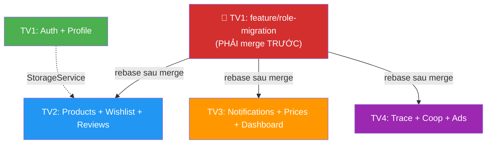

# 📋 Phân công công việc AgriLink Mobile — 4 thành viên

> Dựa trên khảo sát toàn bộ **13 modules BE** (41 entities) + Master Prompt
> Ngày cập nhật: 02/07/2026

---

## Hệ thống Roles

### Master Prompt — 4 roles cho Mobile

| Role | Tên hiển thị | Mô tả | Mặc định |
|------|-------------|-------|----------|
| `farmer` | Nông dân | Đăng bán nông sản, quản lý trang trại | ✅ |
| `agent` | Đại lý | Thu mua, phân phối nông sản | |
| `expert` | Chuyên gia | Tư vấn kỹ thuật nông nghiệp | |

> Admin **không có trên mobile** — chỉ dùng web dashboard.

### Cấu trúc thư mục theo Master Prompt

```
lib/screens/
├── auth/
│   ├── login_screen.dart
│   ├── otp_screen.dart
│   └── role_picker_screen.dart
├── farmer/
│   └── farmer_home_screen.dart
├── agent/
│   └── agent_home_screen.dart
└── expert/
    └── expert_home_screen.dart
```

> [!WARNING]
> **Mobile hiện tại dùng roles sai.** Code hiện dùng `farmer`, `supplier`, `customer` — cần đổi thành `farmer`, `agent`, `expert` theo Master Prompt.
>
> **BE cũng cần sửa.** File `update-role.dto.ts` hiện chỉ accept `farmer`, `supplier`, `buyer`. Cần thêm `agent` + `expert` vào `UserRole` enum và `UpdateRoleDto`.

### BE cần sửa (do TV1 thực hiện)

#### File 1: `src/common/enums/index.ts`
```diff
 export enum UserRole {
   FARMER = 'farmer',
   COOPERATIVE = 'cooperative',
   BUYER = 'buyer',
   ENTERPRISE = 'enterprise',
   SUPPLIER = 'supplier',
   LOGISTICS = 'logistics',
   STATE_AGENCY = 'state_agency',
   ADMIN = 'admin',
+  AGENT = 'agent',
+  EXPERT = 'expert',
 }
```

#### File 2: `src/modules/users/dto/update-role.dto.ts`
```diff
 export class UpdateRoleDto {
-  @ApiProperty({ enum: [UserRole.FARMER, UserRole.SUPPLIER, UserRole.BUYER] })
-  @IsIn([UserRole.FARMER, UserRole.SUPPLIER, UserRole.BUYER])
+  @ApiProperty({ enum: [UserRole.FARMER, UserRole.AGENT, UserRole.EXPERT] })
+  @IsIn([UserRole.FARMER, UserRole.AGENT, UserRole.EXPERT])
   role: UserRole;
 }
```

#### File 3: `src/modules/users/users.service.ts`
```diff
   async updateMyRole(userId: string, role: UserRole): Promise<Partial<User>> {
-    if (![UserRole.FARMER, UserRole.SUPPLIER, UserRole.BUYER].includes(role)) {
+    if (![UserRole.FARMER, UserRole.AGENT, UserRole.EXPERT].includes(role)) {
       throw new BadRequestException(
         "Role is not allowed for mobile onboarding",
       );
```

---

## Tổng quan BE APIs (NestJS) — đã sẵn sàng

```mermaid
graph LR
    subgraph "13 BE Modules"
        Auth["Auth<br/>sync, login, OTP, refresh, logout"]
        Users["Users<br/>me, me/role, PATCH me"]
        Profiles["Profiles<br/>farmer, b2b, farm public"]
        Products["Products<br/>CRUD, images, certs, categories"]
        Wishlist["Wishlist<br/>add, remove, list, ids"]
        Reviews["Reviews<br/>create, reply, list by product"]
        MarketPrices["Market Prices<br/>list, create"]
        Trace["Traceability<br/>QR scan, by product, create"]
        Notif["Notifications<br/>list, mark read, read all"]
        Coop["Cooperatives<br/>members, bulk listings, harvest"]
        Ads["Ads<br/>packages, campaigns, events"]
        Geo["Geography<br/>provinces, districts"]
        Storage["Storage<br/>presign URL, image upload"]
    end
```



---

## Những gì BẠN đã làm ✅

| Phần | Chi tiết |
|------|----------|
| Auth flow | Firebase OTP → sync BE → JWT → role picker → redirect |
| Marketplace | Danh sách sản phẩm, chi tiết sản phẩm (gọi API thật) |
| Cart | Local state (CartProvider), UI giỏ hàng |
| Dashboard UI | 3 dashboard mock (Farmer, Supplier, Customer) — **cần đổi thành Farmer, Agent, Expert** |
| Infrastructure | ApiService (Dio + interceptor), TokenStorage, PhoneFormatter |
| Reusable widgets | AgriButton, AgriCard, AgriTextField, ProductCard, ProductBadge, EmptyState, LoadingOverlay, PhoneInput |
| Routing | AppRouter (9 routes) |
| Theme & Design | AppColors, AppTextStyles, AppTheme, AppStrings |

---

## Hướng dẫn cấu hình BE cho MỌI thành viên

> [!IMPORTANT]
> **Mỗi người cần làm phần này TRƯỚC khi code mobile:**

### Bước 1: Clone & cài BE
```bash
git clone <repo-url> AgriLink_backend
cd AgriLink_backend
npm install
```

### Bước 2: Tạo file `.env`
```env
APP_PORT=5000
NODE_ENV=development

# Database (Docker PostgreSQL)
DB_HOST=localhost
DB_PORT=5432
DB_USERNAME=postgres
DB_PASSWORD=postgres
DB_DATABASE=agrilink

# JWT
JWT_SECRET=your-secret-key-here
JWT_EXPIRES_IN=24h
JWT_REFRESH_SECRET=your-refresh-secret
JWT_REFRESH_EXPIRES_IN=7d

# Firebase Admin SDK
GOOGLE_APPLICATION_CREDENTIALS="<đường dẫn tuyệt đối tới file service account .json>"

# Cloudinary (cho upload ảnh — lấy từ team lead)
CLOUDINARY_CLOUD_NAME=xxx
CLOUDINARY_API_KEY=xxx
CLOUDINARY_API_SECRET=xxx
```

### Bước 3: Chạy Docker + BE
```bash
docker-compose up -d    # PostgreSQL + pgAdmin
npm run start:dev       # NestJS dev server → http://localhost:5000/api/v1
```

### Bước 4: Seed dữ liệu test
```
POST http://localhost:5000/api/v1/products/seed
```

### Bước 5: Clone Mobile + cấu hình
```bash
git clone <mobile-repo-url> agrilink
cd agrilink
flutter pub get
```
- Android Emulator: `api_constants.dart` trỏ `http://10.0.2.2:5000/api/v1` ✅
- Device thật: đổi IP thành IP LAN máy chạy BE

---

## 🧑‍💻 Phân công chi tiết — 4 thành viên

---

### 👤 TV1 (BẠN — Chủ dự án): Auth + Profile + Infrastructure + Role Migration

**Lý do**: Bạn nắm rõ Auth flow, infrastructure, và cần chỉnh lại role system cho toàn dự án.

#### Đã hoàn thành ✅
- [x] Firebase OTP → Sync → JWT
- [x] Role Picker (cần đổi roles)
- [x] ApiService (Dio + Bearer interceptor)
- [x] TokenStorage, PhoneFormatter
- [x] AppRouter, Theme, Constants

#### Cần làm

| # | Task | BE API | Files | Ưu tiên |
|---|------|--------|-------|---------|
| 1 | **Role Migration** — Đổi roles từ (farmer/supplier/customer) sang (farmer/agent/expert) | Sửa BE: `enums`, `update-role.dto.ts`, `users.service.ts` | Sửa: `user_model.dart`, `role_picker_screen.dart`, `home_screen.dart`, `app_strings.dart` | 🔴 Cao |
| 2 | **Folder restructure** — Đổi `screens/dashboard/` thành `screens/farmer/`, `screens/agent/`, `screens/expert/` | — | Rename + refactor 3 dashboard screens | 🔴 Cao |
| 3 | **Profile Edit** — Sửa fullName, avatar, thông tin cá nhân | `PATCH /users/me` | `lib/screens/profile/edit_profile_screen.dart` | 🔴 Cao |
| 4 | **Avatar Upload** — Camera/Gallery → Cloudinary | `POST /storage/images/upload` | `lib/data/services/storage_service.dart`, thêm `image_picker` package | 🔴 Cao |
| 5 | **Refresh Token** — Auto refresh khi JWT hết hạn | `POST /auth/refresh` | Sửa `api_service.dart` thêm 401 retry interceptor | 🔴 Cao |
| 6 | **Farmer Profile KYC** — Form CCCD, tên nông trại, diện tích | `PUT /profiles/farmer` | `lib/screens/profile/farmer_kyc_screen.dart`, `lib/data/models/farmer_profile_model.dart` | 🟡 TB |
| 7 | **Geography** — Dropdown tỉnh/huyện cho form | `GET /geography/provinces`, `GET .../districts` | `lib/data/services/geography_service.dart`, `lib/widgets/common/province_picker.dart` | 🟡 TB |
| 8 | **Logout API** — Gọi revoke token trên BE | `POST /auth/logout` | Sửa `auth_provider.dart` | 🟢 Thấp |

#### Role Migration chi tiết

**Mobile `user_model.dart`** cần đổi:
```diff
-  bool get isFarmer => role == 'farmer';
-  bool get isSupplier => role == 'supplier';
-  bool get isCustomer => role == 'customer' || role == 'buyer';
-  bool get isValidRole => isFarmer || isSupplier || isCustomer;
+  bool get isFarmer => role == 'farmer';
+  bool get isAgent => role == 'agent';
+  bool get isExpert => role == 'expert';
+  bool get isValidRole => isFarmer || isAgent || isExpert;
```

**`role_picker_screen.dart`** cần đổi 3 roles:
```diff
-  { 'id': 'farmer', 'title': "Nông dân", ... },
-  { 'id': 'supplier', 'title': "Nhà cung cấp", ... },
-  { 'id': 'customer', 'title': "Người mua", ... },
+  { 'id': 'farmer', 'title': "Nông dân", 'description': "Đăng bán nông sản của bạn", ... },
+  { 'id': 'agent', 'title': "Đại lý", 'description': "Thu mua và phân phối nông sản", ... },
+  { 'id': 'expert', 'title': "Chuyên gia", 'description': "Tư vấn kỹ thuật nông nghiệp", ... },
```

**`home_screen.dart`** cần đổi routing logic:
```diff
-  if (role == 'customer') { ... CustomerDashboard }
-  else { ... FarmerDashboard / SupplierDashboard }
+  if (role == 'farmer') { ... FarmerHomeScreen }
+  else if (role == 'agent') { ... AgentHomeScreen }
+  else if (role == 'expert') { ... ExpertHomeScreen }
```

#### Branches
```
feature/role-migration          ← LÀM TRƯỚC, merge sớm để các TV khác có base
feature/auth-profile-edit
feature/auth-refresh-token
feature/farmer-kyc
```

#### Tổng: ~8 files mới, ~8 files sửa

---

### 👤 TV2: Products + Wishlist + Reviews

**Lý do**: Module Products là lõi thương mại. Wishlist và Reviews gắn với sản phẩm, cùng context.

#### BE APIs sử dụng

| API | Method | Mô tả |
|-----|--------|-------|
| `GET /products` | GET | Danh sách + filter |
| `GET /products/:id` | GET | Chi tiết |
| `POST /products` | POST | Tạo sản phẩm (farmer/agent) |
| `PATCH /products/:id` | PATCH | Sửa sản phẩm |
| `DELETE /products/:id` | DELETE | Xóa sản phẩm |
| `GET /products/categories` | GET | Danh mục |
| `GET /products/categories/tree` | GET | Cây danh mục 2 cấp |
| `POST /products/:id/images` | POST | Thêm ảnh |
| `DELETE /products/:id/images/:imgId` | DELETE | Xóa ảnh |
| `POST /wishlist/:productId` | POST | Thêm yêu thích |
| `DELETE /wishlist/:productId` | DELETE | Bỏ yêu thích |
| `GET /wishlist` | GET | Danh sách yêu thích |
| `GET /wishlist/ids` | GET | IDs đã thích (toggle icon) |
| `GET /reviews/product/:id` | GET | Reviews sản phẩm |
| `POST /reviews` | POST | Viết review |
| `PATCH /reviews/:id/reply` | PATCH | Seller trả lời review |

#### Tasks

| # | Task | Files | Ưu tiên |
|---|------|-------|---------|
| 1 | **My Products** — Farmer/Agent xem SP đã đăng | `lib/screens/products/my_products_screen.dart` | 🔴 Cao |
| 2 | **Create Product** — Form tạo SP + upload ảnh | `lib/screens/products/create_product_screen.dart` | 🔴 Cao |
| 3 | **Edit Product** — Form sửa SP | `lib/screens/products/edit_product_screen.dart` | 🔴 Cao |
| 4 | **Product Detail v2** — Hiện reviews, wishlist toggle | Sửa `product_detail_screen.dart` | 🔴 Cao |
| 5 | **Wishlist Screen** — Danh sách yêu thích | `lib/screens/wishlist/wishlist_screen.dart`, `lib/data/services/wishlist_service.dart`, `lib/data/providers/wishlist_provider.dart` | 🟡 TB |
| 6 | **Reviews Section** — List + viết review | `lib/widgets/product/reviews_section.dart`, `lib/data/models/review_model.dart`, `lib/data/services/review_service.dart` | 🟡 TB |
| 7 | **Category Tree** — UI chọn danh mục 2 cấp | `lib/widgets/product/category_picker.dart` | 🟡 TB |
| 8 | **Product Search Advanced** — Filter giá, farmingType, sort | Sửa `marketplace_screen.dart` + thêm filter bottom sheet | 🟢 Thấp |

#### Branches
```
feature/product-crud
feature/wishlist
feature/reviews
```

#### Dependencies
- Cần `StorageService` từ TV1 để upload ảnh sản phẩm (có thể tự tạo tạm)
- **Đợi TV1 merge `feature/role-migration` trước** rồi rebase

#### Tổng: ~12 files mới, ~4 files sửa

---

### 👤 TV3: Notifications + Market Prices + Dashboard Real Data

**Lý do**: 3 module độc lập, không dính Product CRUD. Dashboard cần tổng hợp data từ API.

#### BE APIs sử dụng

| API | Method | Mô tả |
|-----|--------|-------|
| `GET /notifications` | GET | Danh sách thông báo (phân trang) |
| `PATCH /notifications/:id/read` | PATCH | Đánh dấu đã đọc |
| `PATCH /notifications/read-all` | PATCH | Đọc tất cả |
| `GET /market-prices` | GET | Bảng giá nông sản (filter) |
| `GET /products` | GET | Sản phẩm cho dashboard |
| `GET /farm/:userId` | GET | Profile nông trại public |

#### Tasks

| # | Task | Files | Ưu tiên |
|---|------|-------|---------|
| 1 | **Notification Screen** — Danh sách thông báo | `lib/screens/notifications/notifications_screen.dart` | 🔴 Cao |
| 2 | **Notification Badge** — Bell icon + unread count trên AppBar | `lib/widgets/common/notification_badge.dart`, sửa `home_screen.dart` | 🔴 Cao |
| 3 | **Notification Provider** — State management | `lib/data/providers/notification_provider.dart` | 🔴 Cao |
| 4 | **Fix notification_service** — Map đúng API `/notifications` | Sửa `notification_service.dart` | 🔴 Cao |
| 5 | **Market Prices v2** — Real data + filter | Refactor `prices_screen.dart`, `lib/data/models/market_price_model.dart`, `lib/data/services/market_price_service.dart` | 🟡 TB |
| 6 | **Farmer Home v2** — Real stats từ API | Sửa `farmer_home_screen.dart` (tên mới sau migration) | 🟡 TB |
| 7 | **Agent Home v2** — Real data cho đại lý | Sửa `agent_home_screen.dart` | 🟡 TB |
| 8 | **Expert Home v2** — Real data cho chuyên gia | Sửa `expert_home_screen.dart` | 🟢 Thấp |

#### Branches
```
feature/notifications-ui
feature/market-prices-realdata
feature/dashboard-realdata
```

#### Dependencies
- **Đợi TV1 merge `feature/role-migration` trước** — dashboard screens sẽ được rename
- NotificationModel đã có sẵn ✅

#### Tổng: ~8 files mới, ~5 files sửa

---

### 👤 TV4: Traceability + Cooperatives + Ads

**Lý do**: 3 module nâng cao, độc lập với core commerce, phù hợp làm song song.

#### BE APIs sử dụng

| API | Method | Mô tả |
|-----|--------|-------|
| `GET /trace/:qrCode` | GET | Scan QR → xem nguồn gốc |
| `GET /trace/product/:productId` | GET | Truy xuất theo sản phẩm |
| `POST /trace` | POST | Tạo record truy xuất (farmer) |
| `GET /cooperatives/members` | GET | Thành viên HTX |
| `POST /cooperatives/members/:farmerId/invite` | POST | Mời nông dân |
| `POST /cooperatives/bulk-listings` | POST | Tạo bán sỉ |
| `GET /cooperatives/bulk-listings` | GET | Danh sách bán sỉ |
| `POST /cooperatives/harvest-schedules` | POST | Tạo lịch thu hoạch |
| `GET /cooperatives/harvest-schedules` | GET | Xem lịch |
| `GET /ads/packages` | GET | Gói quảng cáo (public) |
| `POST /ads/campaigns` | POST | Tạo chiến dịch QC |
| `GET /ads/campaigns` | GET | DS chiến dịch |

#### Tasks

| # | Task | Files | Ưu tiên |
|---|------|-------|---------|
| 1 | **Traceability v2** — Real data | Refactor `trace_screen.dart`, `lib/data/models/trace_model.dart`, `lib/data/services/trace_service.dart` | 🔴 Cao |
| 2 | **QR Scanner** — Scan QR sản phẩm | `lib/screens/trace/qr_scanner_screen.dart`, thêm package `mobile_scanner` | 🔴 Cao |
| 3 | **Trace Detail** — Timeline nguồn gốc sản phẩm | `lib/screens/trace/trace_detail_screen.dart` | 🟡 TB |
| 4 | **Create Trace Record** — Form cho farmer | `lib/screens/trace/create_trace_screen.dart` | 🟡 TB |
| 5 | **Cooperative Members** — Quản lý thành viên | `lib/screens/cooperative/members_screen.dart`, `lib/data/services/cooperative_service.dart` | 🟡 TB |
| 6 | **Bulk Listing v2** — Real data | Refactor `bulk_listing_screen.dart`, `lib/data/services/bulk_listing_service.dart` | 🟡 TB |
| 7 | **Harvest Schedule** — Lịch thu hoạch | `lib/screens/cooperative/harvest_schedule_screen.dart` | 🟢 Thấp |
| 8 | **Ads Banner** — Hiện banner QC trên home | `lib/widgets/common/ad_banner.dart`, `lib/data/services/ads_service.dart` | 🟢 Thấp |

#### Branches
```
feature/traceability-realdata
feature/cooperative-management
feature/ads-integration
```

#### Dependencies
- QR Scanner cần package `mobile_scanner` → tự thêm vào `pubspec.yaml`
- **Đợi TV1 merge `feature/role-migration` trước** rồi rebase

#### Tổng: ~12 files mới, ~3 files sửa

---

## Ma trận phụ thuộc



| Phụ thuộc | Mức độ | Giải pháp |
|-----------|--------|-----------|
| Tất cả → `feature/role-migration` | 🔴 **Blocking** | TV1 làm trước, merge vào develop ngay tuần 1 |
| TV2 → `StorageService` (TV1) | 🟡 Có thể bypass | TV2 tự tạo `storage_service.dart` tạm |
| TV3 → `AuthProvider` | 🟢 Không block | Đã có sẵn ✅ |
| TV4 → `ProductModel` | 🟢 Không block | Đã có sẵn ✅ |

---

## Quy trình Git

### Branch naming
```
feature/<tên-module>     (ví dụ: feature/notifications-ui)
```

### PR rules
1. Mỗi feature 1 PR riêng → base vào `develop`
2. PR phải qua `flutter analyze` không lỗi
3. Title: `feat(<module>): <mô tả>` hoặc `fix(<module>): <mô tả>`
4. Ai tạo file mới thì tự thêm route vào `app_router.dart` + constant vào `api_constants.dart`

### Tránh conflict
- `app_router.dart`: Thêm case mới vào cuối switch, không sửa case cũ
- `api_constants.dart`: Thêm constant theo section comment riêng
- `pubspec.yaml`: Note trong PR description nếu thêm package mới

---

## Shared Models cần tạo thêm

| Model | Người tạo | Dùng ở |
|-------|-----------|--------|
| `farmer_profile_model.dart` | TV1 | Profile KYC |
| `review_model.dart` | TV2 | Reviews section |
| `wishlist_item_model.dart` | TV2 | Wishlist screen |
| `market_price_model.dart` | TV3 | Prices screen |
| `trace_model.dart` | TV4 | Traceability |
| `cooperative_model.dart` | TV4 | Cooperative members |
| `ad_campaign_model.dart` | TV4 | Ads banner |

---

## Timeline — 2 tuần sprint

| Tuần | TV1 (Bạn) | TV2 | TV3 | TV4 |
|------|-----------|-----|-----|-----|
| **Tuần 1** | 🔴 **Role Migration** (ngày 1-2) → merge sớm<br/>Profile Edit + Upload + Refresh Token | Product CRUD (Create/Edit/My Products) | Notifications UI + Badge | Traceability v2 + QR Scanner |
| **Tuần 2** | Farmer KYC + Geography + Polish | Wishlist + Reviews + Search filter | Market Prices + Dashboard real data | Cooperative + Bulk Listing + Ads |

> [!IMPORTANT]
> **TV1 phải merge `feature/role-migration` vào develop trong 1-2 ngày đầu.** Đây là thay đổi breaking, ảnh hưởng cả 3 TV còn lại. Sau khi merge, thông báo team rebase.

---

## Tóm tắt phân bổ

| Thành viên | Modules | Files mới | Files sửa | Độ khó |
|------------|---------|-----------|-----------|--------|
| **TV1 (Bạn)** | Auth, Profile, Infrastructure, **Role Migration** | ~8 | ~8 | ⭐⭐⭐ |
| **TV2** | Products, Wishlist, Reviews | ~12 | ~4 | ⭐⭐⭐ |
| **TV3** | Notifications, Market Prices, Dashboard | ~8 | ~5 | ⭐⭐ |
| **TV4** | Traceability, Cooperatives, Ads | ~12 | ~3 | ⭐⭐⭐ |
