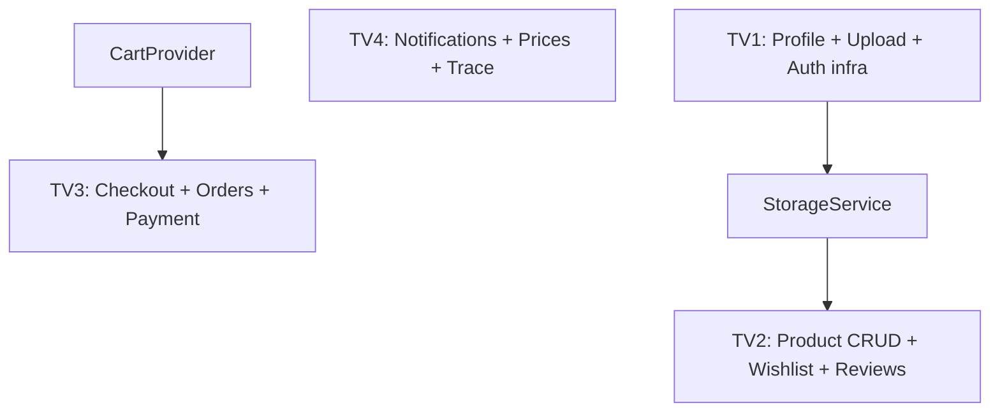

# AgriLink Mobile - Kế hoạch chia việc nhóm 4 thành viên

> Cập nhật: 03/07/2026  
> Mục tiêu: chuẩn hóa kế hoạch sprint cho mobile MVP, giảm conflict, chia việc theo module rõ ràng.

---

## 1. Nguyên tắc chung

1. **Giữ role hiện tại cho MVP:** `farmer`, `supplier`, `customer/buyer`.
2. **Không đổi role sang `agent/expert` trong sprint này**, trừ khi có yêu cầu bắt buộc từ giảng viên/master prompt.
3. **Ưu tiên core business flow:** Auth -> Marketplace -> Cart -> Checkout -> Order -> Payment.
4. **Mỗi feature một branch riêng**, PR vào `develop`.
5. **Không làm chung một file lớn nếu không cần thiết.**
6. Mọi PR phải chạy:

```bash
flutter analyze
```

Nếu có thêm package mới, ghi rõ trong PR description.

---

## 2. Quyết định về role

### Role dùng trong sprint này

| Mobile role | Backend role | Ghi chú |
|-------------|--------------|--------|
| `farmer` | `farmer` | Người bán nông sản |
| `supplier` | `supplier` | Nhà cung cấp vật tư |
| `customer` | `buyer` | Người mua; mobile có thể hiển thị customer |

### Nếu bắt buộc đổi sang `agent/expert`

Tạo riêng branch:

```text
feature/role-migration
```

Branch này phải làm trước và merge trước mọi feature khác. Không giao TV2/TV3/TV4 sửa dashboard/product/order trên base cũ trong lúc role migration chưa xong.

---

## 3. Sprint goal

Trong 2 tuần, mục tiêu MVP nên đạt:

- Đăng nhập Firebase OTP -> JWT backend ổn định
- Người dùng xem marketplace/product detail
- Thêm sản phẩm vào giỏ
- Checkout tạo order
- Xem lịch sử đơn hàng
- Có profile edit cơ bản
- Farmer/supplier tạo/sửa sản phẩm với ảnh
- Có notification screen cơ bản
- Có market prices hoặc traceability real data nếu còn thời gian

---

## 4. Phân công tổng quan

| Thành viên | Trọng tâm | Độ ưu tiên |
|------------|-----------|------------|
| TV1 | Auth, Profile, Infrastructure, Upload shared | Cao |
| TV2 | Product CRUD, Wishlist, Reviews | Cao |
| TV3 | Cart, Checkout, Orders, Payment | Rất cao |
| TV4 | Notifications, Market Prices, Traceability | Trung bình - cao |

---

## 5. TV1 - Auth, Profile, Infrastructure

### Vai trò

TV1 giữ nền tảng chung để các thành viên khác không bị block: auth, profile, upload, API utilities, shared widgets.

### Task chính

| # | Task | API | Files dự kiến | Ưu tiên |
|---|------|-----|---------------|---------|
| 1 | Profile edit | `PATCH /users/me` | `lib/screens/profile/edit_profile_screen.dart`, sửa `home_screen.dart` | Cao |
| 2 | Avatar upload | `POST /storage/images/upload` | `lib/data/services/storage_service.dart`, thêm image picker | Cao |
| 3 | Refresh token / retry 401 | `POST /auth/refresh` | sửa `api_service.dart`, `token_storage.dart` | Cao |
| 4 | Logout API | `POST /auth/logout` | sửa `auth_provider.dart` | Trung bình |
| 5 | Shared form widgets | - | `lib/widgets/common/*` | Trung bình |
| 6 | Geography dropdown | `/geography/provinces`, `/districts` | `geography_service.dart`, `province_picker.dart` | Trung bình |

### Branch đề xuất

```text
feature/profile-edit
feature/storage-upload-service
feature/auth-refresh-token
feature/geography-picker
```

### Deliverable cuối sprint

- User sửa được tên/avatar.
- Token hết hạn không làm app văng đột ngột.
- Có service upload dùng chung cho product/profile.

---

## 6. TV2 - Products, Wishlist, Reviews

### Vai trò

TV2 chịu trách nhiệm làm product module đủ thật để farmer/supplier đăng sản phẩm và customer tương tác với sản phẩm.

### Task chính

| # | Task | API | Files dự kiến | Ưu tiên |
|---|------|-----|---------------|---------|
| 1 | My Products | `GET /products?mine=true` hoặc API tương ứng | `my_products_screen.dart` | Cao |
| 2 | Create Product | `POST /products` | `create_product_screen.dart`, `product_repository.dart` | Cao |
| 3 | Edit Product | `PATCH /products/:id` | `edit_product_screen.dart` | Cao |
| 4 | Product image upload | `POST /products/:id/images` | dùng `StorageService` hoặc service riêng | Cao |
| 5 | Wishlist toggle | `POST/DELETE /wishlist/:productId` | `wishlist_service.dart`, sửa product card/detail | Trung bình |
| 6 | Wishlist screen | `GET /wishlist` | `wishlist_screen.dart`, `wishlist_provider.dart` | Trung bình |
| 7 | Reviews section | `GET /reviews/product/:id`, `POST /reviews` | `review_model.dart`, `reviews_section.dart` | Trung bình |
| 8 | Category picker tree | `/products/categories/tree` | `category_picker.dart` | Thấp |

### Branch đề xuất

```text
feature/product-crud-mobile
feature/product-image-upload
feature/wishlist-mobile
feature/reviews-mobile
```

### Dependencies

- Cần TV1 cung cấp `StorageService`. Nếu chưa có, TV2 có thể làm service tạm và sau đó refactor.
- Không phụ thuộc checkout/order.

### Deliverable cuối sprint

- Farmer/supplier tạo và sửa được sản phẩm.
- Customer wishlist/review được sản phẩm.
- Product detail có dữ liệu phong phú hơn.

---

## 7. TV3 - Cart, Checkout, Orders, Payment

### Vai trò

TV3 phụ trách core flow quan trọng nhất của MVP. Đây là phần quyết định demo có giống app thương mại thật hay không.

### Task chính

| # | Task | API | Files dự kiến | Ưu tiên |
|---|------|-----|---------------|---------|
| 1 | Checkout screen | Order API / Cart data | `checkout_screen.dart` | Rất cao |
| 2 | Create order từ cart | `POST /orders` hoặc API tương ứng | `order_service.dart`, `order_model.dart` | Rất cao |
| 3 | Order success | - | `order_success_screen.dart` | Cao |
| 4 | Order history | `GET /orders` | `order_history_screen.dart` | Cao |
| 5 | Order detail | `GET /orders/:id` | `order_detail_screen.dart` | Cao |
| 6 | Payment integration | VNPay/payment API | `payment_service.dart`, webview/deeplink nếu cần | Trung bình |
| 7 | Cart persistence | Cart API nếu có | sửa `cart_provider.dart` | Trung bình |

### Branch đề xuất

```text
feature/checkout-flow
feature/order-history
feature/payment-integration
feature/cart-sync
```

### Dependencies

- Dùng `CartProvider` hiện tại làm input ban đầu.
- Cần xác nhận endpoint order/payment thật từ BE trước khi code sâu.
- Nếu BE chưa đủ API order, làm mock order service interface trước để UI không bị block.

### Deliverable cuối sprint

- Customer mua được hàng từ cart tới order success.
- Xem được lịch sử đơn.
- Payment có thể là mock nếu VNPay mobile chưa sẵn sàng, nhưng flow UI phải hoàn chỉnh.

---

## 8. TV4 - Notifications, Market Prices, Traceability

### Vai trò

TV4 phụ trách các module tăng độ hoàn thiện sản phẩm, ít conflict với product/order.

### Task chính

| # | Task | API | Files dự kiến | Ưu tiên |
|---|------|-----|---------------|---------|
| 1 | Notifications screen | `GET /notifications` | `notifications_screen.dart` | Cao |
| 2 | Notification badge | notification count/list | `notification_badge.dart`, sửa `home_screen.dart` | Cao |
| 3 | Notification provider | service hiện có | `notification_provider.dart` | Cao |
| 4 | Fix notification API mapping | BE REST notifications | sửa `notification_service.dart`, `api_constants.dart` | Cao |
| 5 | Market prices real data | `GET /market-prices` | `market_price_model.dart`, `market_price_service.dart`, sửa `prices_screen.dart` | Trung bình |
| 6 | Traceability real data | `GET /trace/:qrCode` | `trace_service.dart`, `trace_model.dart`, sửa `trace_screen.dart` | Trung bình |
| 7 | QR scanner | - | thêm `mobile_scanner`, `qr_scanner_screen.dart` | Trung bình |
| 8 | Trace detail timeline | `GET /trace/product/:productId` | `trace_detail_screen.dart`, timeline widget | Thấp |

### Branch đề xuất

```text
feature/notifications-ui
feature/market-prices-realdata
feature/traceability-mobile
feature/qr-scanner
```

### Lưu ý socket

Hiện mobile đã tắt socket flag vì BE chưa có Socket.IO gateway. TV4 **không bật lại socket** nếu BE chưa triển khai `@WebSocketGateway`.

MVP nên dùng REST notifications trước.

### Deliverable cuối sprint

- Có màn thông báo cơ bản.
- Có badge/unread state.
- Có bảng giá thật hoặc trace QR thật.

---

## 9. Ma trận phụ thuộc



| Phụ thuộc | Mức độ | Cách xử lý |
|-----------|--------|-----------|
| TV2 cần upload service | Trung bình | TV1 làm trước hoặc TV2 làm tạm |
| TV3 cần order/payment API | Cao | Xác nhận BE endpoint trước khi code |
| TV4 notification socket | Thấp | Dùng REST trước, không cần gateway |
| Role migration | Blocking nếu có | Chỉ làm nếu bắt buộc, branch riêng |

---

## 10. Timeline đề xuất - 2 tuần

### Tuần 1

| Thành viên | Việc chính |
|------------|------------|
| TV1 | Profile edit, upload service, refresh token |
| TV2 | Product create/edit/my products |
| TV3 | Checkout screen, create order, order success |
| TV4 | Notifications UI, badge, notification provider |

### Tuần 2

| Thành viên | Việc chính |
|------------|------------|
| TV1 | Geography picker, logout API, polish profile |
| TV2 | Wishlist, reviews, category tree |
| TV3 | Order history/detail, payment integration/mock |
| TV4 | Market prices real data, traceability, QR scanner |

---

## 11. Git workflow

### Branch naming

```text
feature/<module-name>
fix/<bug-name>
chore/<infra-name>
```

Ví dụ:

```text
feature/checkout-flow
feature/product-crud-mobile
feature/notifications-ui
fix/cart-total-calculation
```

### PR checklist

Mỗi PR cần có:

- Mô tả feature.
- Screenshot hoặc video ngắn nếu có UI.
- API endpoint đã dùng.
- Kết quả `flutter analyze`.
- Note nếu thêm package mới.

### Tránh conflict

| File | Quy tắc |
|------|---------|
| `app_router.dart` | Thêm route mới, không đổi route cũ nếu không cần |
| `api_constants.dart` | Thêm constant theo section |
| `pubspec.yaml` | Mỗi PR thêm package phải ghi rõ |
| `home_screen.dart` | TV1/TV4/TV3 cần báo nhau nếu cùng sửa bottom nav |
| `product_model.dart` | TV2 sở hữu chính, người khác hỏi trước khi sửa |

---

## 12. Backlog sau MVP

Sau khi core flow chạy được, mới ưu tiên:

- Push notification FCM
- Socket.IO gateway
- Cooperative management
- Ads campaign
- Chat/messaging
- Gamification
- Advanced analytics dashboard
- Full test suite và CI/CD

---

## 13. Tóm tắt phân bổ

| Thành viên | Modules | Files mới dự kiến | Files sửa dự kiến | Độ khó |
|------------|---------|-------------------|-------------------|--------|
| TV1 | Auth/Profile/Infra/Upload | 6-8 | 5-7 | Khó |
| TV2 | Product/Wishlist/Reviews | 10-12 | 4-6 | Khó |
| TV3 | Checkout/Orders/Payment | 8-10 | 4-6 | Khó nhất |
| TV4 | Notifications/Prices/Trace | 8-10 | 4-5 | Trung bình |

Kế hoạch này giúp 4 người làm song song nhưng vẫn tập trung vào mục tiêu demo: **người dùng đăng nhập, xem sản phẩm, thêm vào giỏ, checkout, tạo đơn và theo dõi đơn hàng**.

